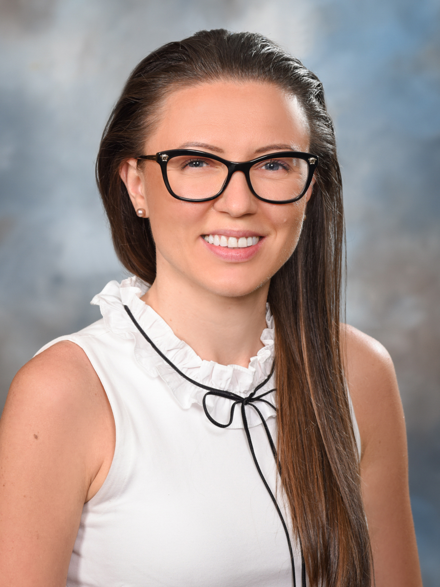

 

####I am a _statistician_ at [Johnson&Johnson](https://www.jnj.com/) with 7+ years of experience in drug development, supporting array of projects spinning through all the phases of drug discovery across different therapeutic areas, with the focus in Neuroscience and Oncology. 

#### I hold a B.S. and M.S. degrees in Statistics and Biostatistics from [Rutgers University](https://www.rutgers.edu/). I am currently a part-time _Doctorate Student_ in Biostatistics at [Columbia University](https://www.mailman.columbia.edu/become-student/departments/biostatistics). 
#### I have passion for data, science, combination of the two, statistics, data visualization, and technology. I value creativity and cutting-edge thinking and embrace opportunities for change and exploration. I am curious, ambitious and never stop learning. I truly believe that there are no dreams too large, no innovation unimaginable and no frontiers beyond our reach.  
#### _Welcome to my world!_
