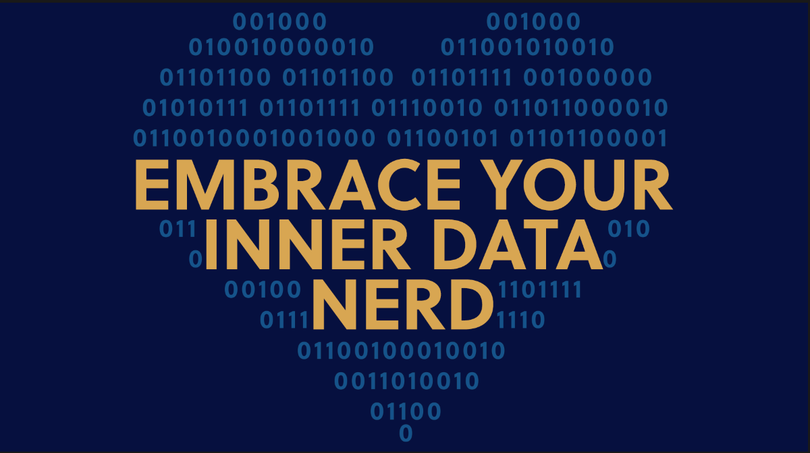

 

  

### "In God we trust, all others must bring data"
* I am inspired by current scientific questions rising in pharmaceutical industry around new drug development.  
* I have been heavily involved in *biomarker research*, supporting Janssen`s World Without Disease vision in Neurocience and Oncology.  
* *Data mining* and *vizualization* have been something I am trully passionate about.  
* I embrace big chalenges of *big data* and enjoy analyzing complex datasets coming out of *new technologies*. I have been waiting impatiently to voyage through my whole genome sequencing data - it is coming soon!    

### My data scientist toolbox includes:  
* superb _R_ programming skills,  
* strong knowledge and implementaion of reproducable research, 
* [tidyverse](https://www.tidyverse.org/), 
* Shiny applications development.  

